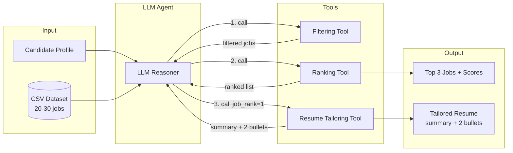

# AI Job Search Agent – Assignment Report  
**3–4 Pages Maximum**

---

## 1. Agent Architecture (Diagram Required)

The agent follows the required pipeline: **Input Candidate Profile → Analyze Dataset → Decide Filtering → Rank Jobs → Select Best Job → Tailor Resume**. The LLM decides which tool to call and in what order via function/tool calling (OpenAI or Anthropic); a fallback fixed sequence runs if no API key is set.

**Architecture diagram:**

**Component roles:**
- **Candidate profile:** Title, years of experience, skills, preferred locations (and optional remote preference).
- **CSV dataset:** 20–30 AI/ML jobs with Title, Company, Location, Required Skills, Years of Experience, Short Description, URL.
- **LLM agent:** Receives profile + job count; chooses and invokes tools in sequence; produces a reasoning trace.
- **Filtering tool:** Applies location, experience limit, company exclusion, and optional remote-only rules.
- **Ranking tool:** Scores jobs by skill, title, location, experience; returns a ranked list with scores.
- **Resume tailoring tool:** Rewrites the professional summary and exactly two experience bullets for the top-ranked job; highlights aligned skills; does not regenerate the full resume.

---

## 2. Tool Descriptions

| Tool | Purpose | Inputs | Output |
|------|---------|--------|--------|
| **Filtering Tool** | Reduce the dataset to jobs that match the candidate’s constraints. | Full job list, candidate profile, optional `remote_only`. | Filtered list of jobs (location match, experience limit, company exclusion, optional remote-only). |
| **Ranking Tool** | Score and order jobs by fit to the profile. | Filtered jobs, profile, optional `top_n`. | Ranked list of jobs with scores 0–100 (skill, title, location, experience, recency). |
| **Resume Tailoring Tool** | Produce a tailored resume for one job only (the top-ranked). | Profile, chosen ranked job (e.g. rank 1), optional LLM flag. | Rewritten professional summary, exactly two modified experience bullets, and highlighted aligned skills. Rest of resume unchanged. |

---

## 3. Prompt Design Strategy

- **System prompt:** Defines the agent’s role and the three tools. It states the required order (filter → rank → tailor) and that the agent must decide when to call each tool and call exactly one per turn. This keeps behavior consistent while leaving the *decision* to the LLM (satisfying the “no hard-coded script” requirement).
- **User prompt:** Injects the candidate profile (title, years, skills, locations) and the number of jobs in the dataset. It instructs the model to choose the first tool, then use each tool’s result to decide the next step until filtering, ranking, and resume tailoring for the top job are done.
- **Tool definitions (API):** Each tool has a short description and parameters (e.g. `ranking_tool` has optional `top_n`; `resume_tailoring_tool` has required `job_rank`). The LLM uses these to decide which tool to call and with what arguments.
- **Fallback:** If the LLM does not complete the workflow (e.g. no tool-calling API), a fixed pipeline runs (filter → rank → tailor for rank 1), and a separate LLM call can still produce a short reasoning trace for the report.

---

## 4. Filtering and Ranking Logic

**Filtering (order applied in code):**  
(1) **Company exclusion** — Drop jobs whose company name is in the exclusion list (e.g. FAANG).  
(2) **Remote-only (optional)** — If the profile requests remote-only, keep only jobs whose location contains “remote”.  
(3) **Location preference** — If the profile has preferred locations, keep only jobs whose location matches at least one.  
(4) **Experience limit** — Keep only jobs where required years of experience ≤ candidate’s years.  
(5) **Skills overlap** — Keep only jobs that share at least one skill with the profile.

**Ranking:**  
Each job receives an overall score (0–100) as a weighted sum: **skill match (0.35)**, **title match (0.20)**, **location match (0.15)**, **recency (0.10)**, **experience alignment (0.10)**, **company (0.05)**, **salary (0.05)**. Jobs are sorted by this score descending. Skill matching uses synonyms and fuzzy matching; title/location use keyword and overlap logic. The UI and script both show the full ranked list with scores and explicitly label the **Top 3 jobs**.

---

## 5. Top 3 Jobs with Scores

*[Fill after running the agent; copy from UI or script output.]*

| Rank | Job Title | Company | Location | Score |
|------|-----------|---------|----------|-------|
| 1 | *[e.g. AI/ML Engineer]* | *[Company]* | *[Location]* | *[e.g. 78%]* |
| 2 | | | | |
| 3 | | | | |

---

## 6. Tailored Resume Snippet

*[Paste the “Rewritten Professional Summary” and “Modified Experience Bullet Points (exactly 2)” from one run for the top-ranked job.]*

**Rewritten Professional Summary**  
*[Paste here.]*

**Highlight Aligned Skills**  
*[e.g. Python, machine learning, TensorFlow]*

**Modified Experience Bullet Points (exactly 2)**  
- *[Bullet 1]*  
- *[Bullet 2]*

*(Rest of resume unchanged.)*

---

## 7. Short Ethics Reflection (½ page)

*[Write about ½ page on ethical considerations. Suggestions: fairness of automated filtering (e.g. excluding certain companies or locations); transparency of scoring and ranking; use of LLM for resume text (authenticity, accuracy); privacy if profile or job data were sent to external APIs; and any steps you took or would take to mitigate bias or harm. Adjust to your course’s emphasis.]*

**Possible points to cover:**
- **Fairness:** Filtering by location or company can reinforce geographic or structural inequalities; making rules and thresholds explicit helps users understand why jobs are included or excluded.
- **Transparency:** Showing the reasoning trace and score breakdown lets users see how the agent and tools behave, which supports accountability and trust.
- **Resume generation:** LLM-generated summary and bullets should reflect the candidate’s real experience; we use the candidate’s own bullets as the base and only modify two, reducing fabrication risk.
- **Privacy:** Profile and job data may be sent to third-party LLM APIs; users should be informed and, where possible, have the option to use local or no-LLM modes.

---

*Report template: fill in Sections 5, 6, and 7 from your own run and reflection. Export this file to PDF for submission if required.*
